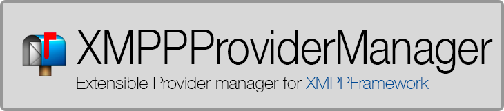

# XMPPProviderManager - A lightweight manager for received stanzas

[](https://cocoapods.org/pods/InAppNotify) [](https://cocoapods.org/pods/InAppNotify) [](https://cocoapods.org/pods/InAppNotify) [](https://cocoapods.org/pods/InAppNotify)

During develop of app that include wonderfull [XMPPFramework](https://github.com/robbiehanson/XMPPFramework) of **Robbie Hanson**, i was looking for a smart way to manage custom tags inside __&lt;message&gt;__, so, i created this library. Choose **XMPPProviderManager** for your next project, I'll be happy to give you a little help!

<p align="center" >★★ <b>Star our github repository to help us!, or <a href="https://www.paypal.com/cgi-bin/webscr?cmd=_s-xclick&hosted_button_id=BZD2RPBADPA6G" target="_blank"> ☕ pay me a coffee</a></b> ★★</p>
<p align="center" >Created by <a href="http://www.lucabecchetti.com">Luca Becchetti</a></p>

## Requirements

  - [XMPPFramework](https://github.com/robbiehanson/XMPPFramework) 
  - iOS 9+
  - swift 4.0
  
## Main features
Here's a highlight of the main features you can find in XMPPProviderManager:

* **Parse custom tag inside message**
* **Parse message inside items** for message sent in XMPPPubSub.
* **Support children nodes** You can parse infinity levels of children
  
## You also may like

Do you like `XMPPProviderManager`? I'm also working on several other opensource libraries.

Take a look here:

* **[InAppNotify](https://github.com/lucabecchetti/InAppNotify)** - Manage in app notifications
* **[CountriesViewController](https://github.com/lucabecchetti/CountriesViewController)** - Countries selection view
* **[SwiftMulticastProtocol](https://github.com/lucabecchetti/SwiftMulticastProtocol)** - send message to multiple classes
* **[SwiftMultiSelect](https://github.com/lucabecchetti/SwiftMultiSelect)** - Generic multi selection tableview

## Installation with CocoaPods

[CocoaPods](http://cocoapods.org) is a dependency manager for Objective-C, which automates and simplifies the process of using 3rd-party libraries like SwiftMultiSelect in your projects. You can install it with the following command:

```bash
$ gem install cocoapods
```

#### Podfile

To integrate XMPPProviderManager into your Xcode project using CocoaPods, specify it in your `Podfile`:

```ruby
source 'https://github.com/CocoaPods/Specs.git'
platform :ios, '9.0'

target 'TargetName' do
  use_frameworks!
  pod 'XMPPProviderManager'
end
```

Then, run the following command:

```bash
$ pod install
```

## How to use

First of all, we suppose you have a project that running XMPPFramework, and it work, import library in your project

```swift
import XMPPProviderManager
```

### Create an instance
Then create an instance for this library and set a delegate:  

```swift
class myXmppManage{

	... initialization of XMPPFramework ...

	let xmppProviderManager = XMPPProviderManager()
	xmppProviderManager?.activate(xmppStream: xmppStream!, delegateQueue: xmppHandlingQ)
	xmppProviderManager?.delegage = self

}
```

### Set a delegate

The delegate must implement: `XMPPProviderManagerDelegate` to manage parsed tags, here an example:

```swift
extension myXmppManage : XMPPProviderManagerDelegate{

	func xmppProviderManager(_ manager: XMPPProviderManager!, didParse item: ProviderItem) {

        print("Provider did found: \(item.extensions.count) extensions")
        item.extensions.forEach { (ext) in
            print(String(describing: type(of:ext)))
        }
        
        /// Try to extract and cast extension
        let myObj = item.extensions.first(where: { (ext) -> Bool in return ext is MyObj })
	}

}
```

### Register extensions

To manage a custom tag, you have to create a class that represent it, this needs to implement: `XMPPProviderExtension` protocol, you have to create a class for each tag you want to manage, here an example, immagine this stanza:

```xml
<message id="111" type="chat" from="xxx@node0.frind.it" to="yyy@node0.frind.it">
     <userdata phone="+1111111" picUrl="http://www.pic.com" displayName="ProviderTest"></userdata>
</message>
```

To manage `<userdata/>` tag, create this class:

```swift
class UserdataExt : NSObject, XMPPProviderExtension{
    
    static var nodename     : String     = "userdata"
    static var namespace    : String    = ""
    var providerNode        : XMPPMessage?
    var fromJid             : XMPPJID?
    
    /// Fields to describe user data
    var phone       : String?
    var displayName : String?
    var picUrl      : String?
    
    /// Initialize provider
    ///
    /// - Parameters:
    ///   - phone: User phone number
    ///   - displayName: User displayName
    ///   - picUrl: User picUrl
    public init(phone:String?, displayName : String?, picUrl : String?){
        
        super.init()
        self.phone          = phone
        self.displayName    = displayName
        self.picUrl         = picUrl
        
    }
    
    static func parse(node: XMPPMessage, parentNode parent: XMPPMessage?) -> XMPPProviderExtension? {
        
        guard node.name! == UserdataExt.nodename else {
            print("Missing node <userdata> while parsing")
            return nil
        }
        
        var phoneNumber = ""
        var displayName = "unknown"
        var picUrl      = ""
        
        if let phn: String = node.attribute(forName: "phone")?.stringValue {
            phoneNumber = phn
        }
        if let dispname: String = node.attribute(forName: "displayName")?.stringValue {
            displayName = dispname
        }
        if let pi: String = node.attribute(forName: "picUrl")?.stringValue {
            picUrl = pi
        }
        
        return UserdataExt(phone: phoneNumber, displayName: displayName, picUrl: picUrl)
        
    }
    
    func toXML() -> XMPPMessage {
        
        let userdata = DDXMLElement(name: UserdataExt.nodename)
        userdata.addAttribute(withName: "phone", objectValue: phone ?? "")
        userdata.addAttribute(withName: "displayName", objectValue: displayName ?? "")
        userdata.addAttribute(withName: "picUrl", objectValue: picUrl ?? "")
        
        return XMPPMessage.init(from: userdata)
        
    }
    
    
}
```

###Usefull method to read attributes from node
If you have to read and parse many string attributes of a node, inside a parse method of you extension, you can use this usefull method:

```swift
/// Find needed attributes
var fields : [String : String?] = [
	"field1" : nil, 
	"field2" : nil,
	"field3" : nil,
	"field4" : nil,
	"field5" : nil
]

do{
   try XMPPProviderManager.find(attributes: &fields, inNode: XMPPMessage.init(from: node))
   
   ///Access attributes:
   print(fields["field1"]!!)
   
}catch let err{
	print(err)
}
```

### Parse children attributes
Immagine to have this structure:

```xml
<message id="111" type="chat" from="xxx@node0.frind.it" to="yyy@node0.frind.it">
     <People>
     	<Person name="" />
     	<Person name="" />
     </people>
</message>
```

and suppose to have the correct extension class for each node: People and Person, provider manager will parse only first level node `<people>`, inside a People class parse method, you can get all `Person` extensions:

```swift
class UserdataExt : NSObject, XMPPProviderExtension{

	.....
	
	static func parse(node: XMPPMessage, parentNode parent: XMPPMessage?) -> XMPPProviderExtension? {

      /// Extract extesions People
      let people = manager!.getExtensions(fromMessage: parent!, type: Person.self).map { $0 as! Person }
      
      print("Found \(people.count) extension")
	
	}

}
```


## Projects using XMPPProviderManager

- Frind - [www.frind.it](https://www.frind.it) 

### Your App and XMPPProviderManager
I'm interested in making a list of all projects which use this library. Feel free to open an Issue on GitHub with the name and links of your project; we'll add it to this site.

## Credits & License
XMPPProviderManager is owned and maintained by [Luca Becchetti](http://www.lucabecchetti.com) 

As open source creation any help is welcome!

The code of this library is licensed under MIT License; you can use it in commercial products without any limitation.

The only requirement is to add a line in your Credits/About section with the text below:

```
In app notification by XMPPProviderManager - http://www.lucabecchetti.com
Created by Becchetti Luca and licensed under MIT License.
```
## About me

I am a professional programmer with a background in software design and development, currently developing my qualitative skills on a startup company named "[Frind](https://www.frind.it) " as Project Manager and ios senior software engineer.

I'm high skilled in Software Design (10+ years of experience), i have been worked since i was young as webmaster, and i'm a senior Php developer. In the last years i have been worked hard with mobile application programming, Swift for ios world, and Java for Android world.

I'm an expert mobile developer and architect with several years of experience of team managing, design and development on all the major mobile platforms: iOS, Android (3+ years of experience).

I'm also has broad experience on Web design and development both on client and server side and API /Networking design. 

All my last works are hosted on AWS Amazon cloud, i'm able to configure a netowrk, with Unix servers. For my last works i configured apache2, ssl, ejabberd in cluster mode, Api servers with load balancer, and more.

I live in Assisi (Perugia), a small town in Italy, for any question, [contact me](mailto:luca.becchetti@brokenice.it)
